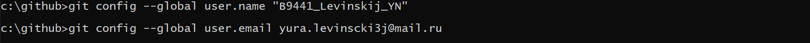
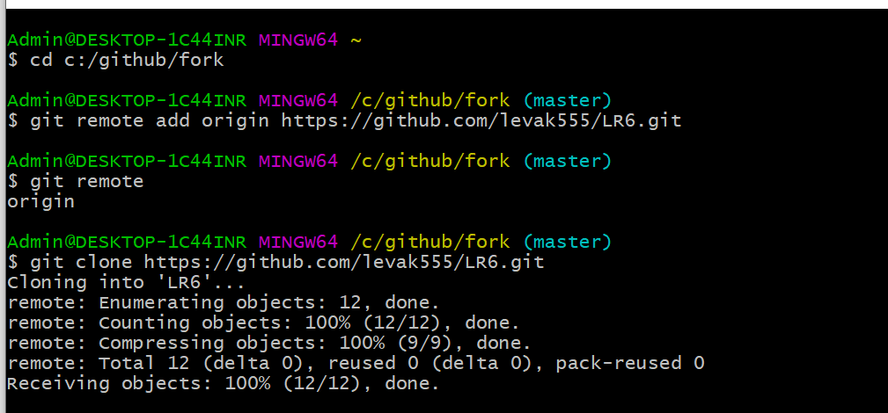
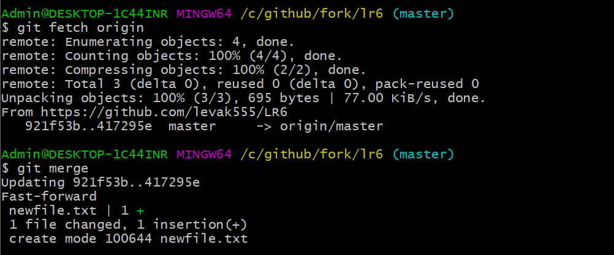
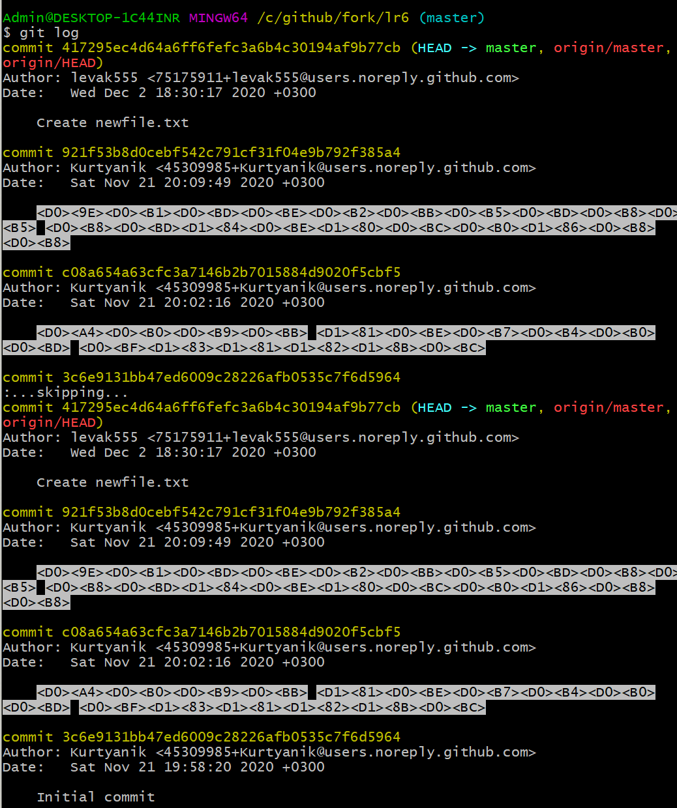
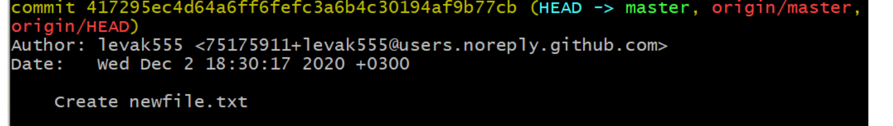
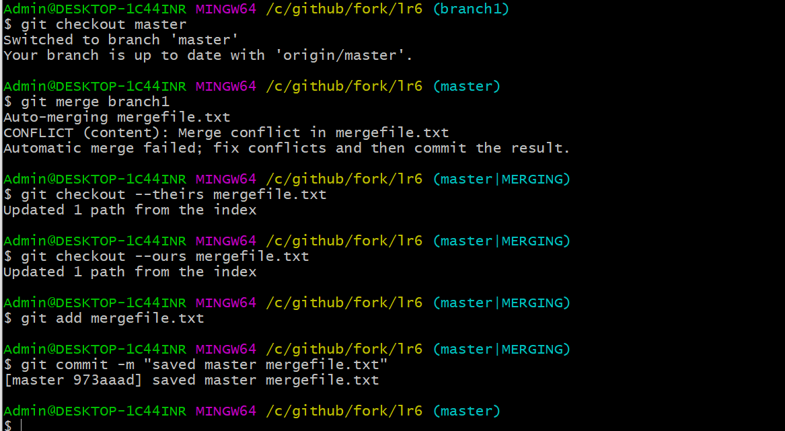
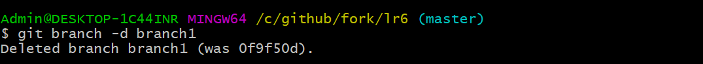
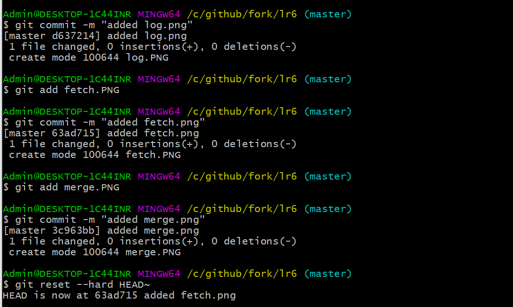
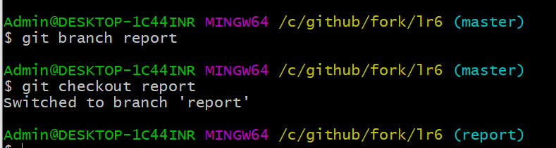
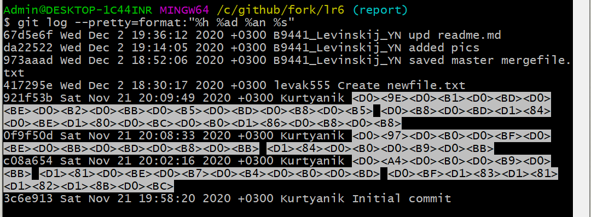

# LR6
Лабораторная работа №6

В ходе работы необходимо было установить git и настроить имя пользователя и email.

После этого в интерфейсе github был сделан форк проекта, а после клонирован в локальную папку

Далее необходимо было добавить файл в github, а затем подтянуть изменения в локальный репозиторий.

После этого необходимо было получить историю операций.

И последние изменения

После этого  был сделан merge branch1 с разрешением конфликта: оставлен оригинальный файл. 

И была удалена ветка branch1

Были сделаны несколько изменений(добавление файлов), а затем был произведен откат коммита.

Была создана ветка report для отчета.

История операций в отформатированном виде:

